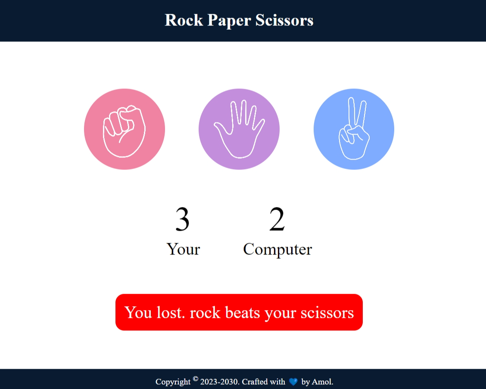

# ✊✋✌️ Rock-Paper-Scissors Game

Welcome to the **Rock-Paper-Scissors** game! 🎉 This is a simple implementation of the classic game using HTML, CSS, and JavaScript.

## 📜 How to Play

1. Select one of the three options: Rock ✊, Paper ✋, or Scissors ✌️.
2. The computer will randomly select its choice 🎲.
3. The winner is determined based on the following rules:
   - Rock crushes Scissors ✊ > ✌️
   - Scissors cuts Paper ✌️ > ✋
   - Paper covers Rock ✋ > ✊

## 🌟 Features

- 🕹️ Interactive UI with buttons to select Rock, Paper, or Scissors.
- 👁️ Displays the player's and computer's choices.
- 🏆 Shows the result of each round: Win, Lose, or Draw.
- ✨ Simple and clean design.

## 🛠️ Technologies Used

- 🌐 HTML5
- 🎨 CSS3
- ⚙️ JavaScript

## 🚀 Getting Started

To get a local copy up and running, follow these simple steps:

### Prerequisites

You need a web browser to run the game. 🌍
